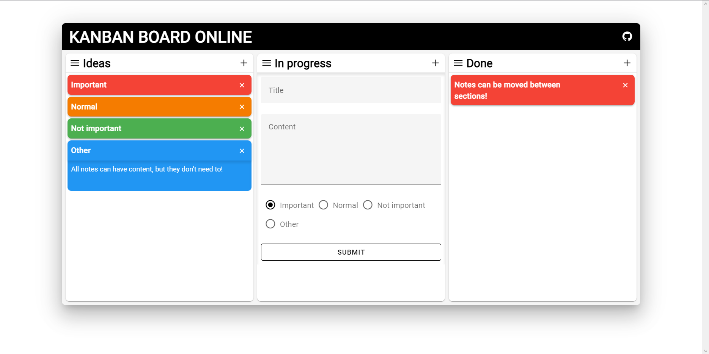
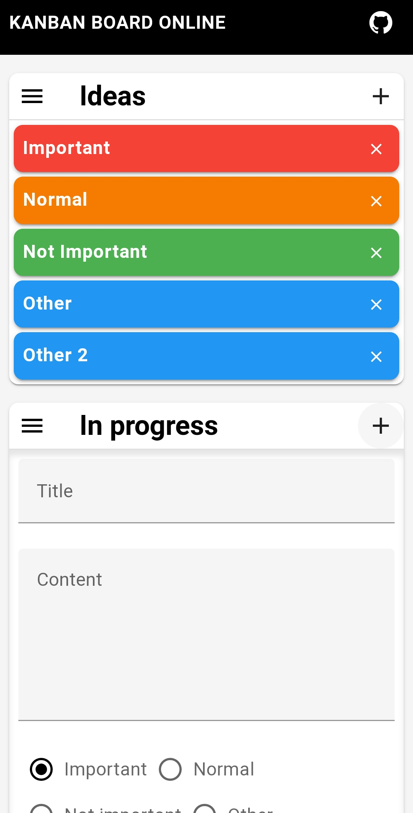

# Kanban-webapp

Check it out [here!](https://mikolaj-mroz.github.io/note-webapp/)


Fully responsive Frontend project made using Vue3 + Vite + Vuetify inspired by Kanban Board.


Web version


Mobile fully responsive version

## Build Setup

``` bash
# install dependencies
npm install

# serve with hot reload at localhost:8080
npm run dev

# build for production with minification
npm run build
```

## Tech

* Vue3
* Vite
* Vuetify
* Vuedraggable
* Material Design Icons

## Conclusion

I should've used Pinia for this project.